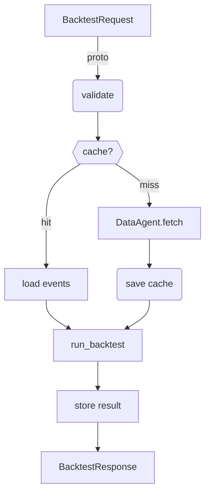

# Backtester Agent – Architecture & Integration Guide

> **Status**  Draft v0.1 – last updated 2025‑07‑05

---

\## Goal
Build an **autonomous uAgent** that can

1. **Fetch historical pool events** (mints, burns, swaps) from *The Graph* and complementary trade quotes from *1inch API*.
2. **Generate an `events.json` bundle** that is byte‑for‑byte compatible with the Solidity/Foundry back‑tester built.
3. **Call the simulation layer** (Foundry script) via function‑calling, wait asynchronously, capture the on‑chain metrics, and
4. Return a typed **`BacktestResponse`** to the user or downstream agents.

\## High‑level Architecture

```ascii
┌──────────────┐      GraphQL        ┌───────────────┐   ffi + JSON   ┌────────────────┐
│  DataAgent   │ ──────────────────▶ │  The Graph    │ ──────────────▶ │ Foundry Script │
│ (uAgents)    │                    │  Subgraph      │                │ UniV4Backtester│
└──────┬───────┘                    └───────────────┘                └────────┬───────┘
       │ 1inch REST                                                ▄▄▄ fork ▄▄▄│
       │                                                              │        │
       │                BacktestRequest               pool‑events.json│        │
┌──────┴───────┐  chat / API   ┌──────────────┐  function‑call  ┌────┴────────┐│
│ BacktestAgent│ ◀──────────── │  Frontend    │ ◀────────────── │ Simulation  ││
│ (uAgents)    │  BacktestResp │  / Client    │                 │  Layer      ││
└──────────────┘               └──────────────┘                 └─────────────┘┘
```

*Everything inside the dotted box runs **locally**; the only network calls are to The Graph and 1inch.*

---

\## Message & Model Contracts

| Model              | Description                                                                               | File                                        |
| ------------------ | ----------------------------------------------------------------------------------------- | ------------------------------------------- |
| `BacktestRequest`  | User‑facing function signature: `{ pool:str, start:int, end:int, strategy_params?:dict }` | `backtest_service.py` fileciteturn2file2 |
| `Events`           | Internal Data‑Agent payload containing the raw event list                                 | `data_agent.py` (see example below)         |
| `BacktestResponse` | Typed metrics returned by simulation (`pnl`, `sharpe`, `fees`, …)                         | `backtest_service.py` fileciteturn2file2 |

> **Note**  All message models extend `uagents.Model` (Pydantic v1) as required by `uagents==0.22.5`.

\### Python type stubs

```python
class BacktestRequest(Model):
    pool: str
    start: int  # unix timestamp
    end:   int
    strategy_params: dict[str, Any] = {}

class BacktestResponse(Model):
    kind: Literal["backtest_result"] = "backtest_result"
    pnl: float; sharpe: float; total_fees: float
    impermanent_loss: float; gas_costs: float
    success: bool; error_message: str = ""
```

---

\## Data Layer

\### DataAgent
\*Location \*: `data_agent.py`

```python
@data_agent.on_message(FetchEvents)
async def handler(ctx, req: FetchEvents):
    # 1️⃣ paginate The Graph
    # 2️⃣ (optional) enrich with 1inch swap quotes for slippage
    # 3️⃣ normalise ➜ PoolEvent schema
    # 4️⃣ ctx.send(sender, Events(events=evts))
```

* **GraphQL endpoint**   `https://api.thegraph.com/subgraphs/name/uniswap/uniswap-v3`
* **Back‑off & retries**   exponential with `aiohttp`, 3 retries
* **Caching**   `BacktestDataManager.cache_graph_data()` to avoid re‑downloads fileciteturn2file5.

\### Function `fetch_events()`

```python
await ctx.send(DATA_AGENT_ADDR, FetchEvents(pool, start, end))
```

Returns an `Events` model that is passed straight into the simulation layer.

---

\## Simulation Layer

* **Tooling**  Foundry (`forge`), Solidity >=0.8.26.
* **Entry script**  `src/UniV4Backtester.s.sol` fileciteturn1file1.

\### Python wrapper

```python
async def run_backtest(pool, start, end, params={}):
    events = await simulate_fetch_events(pool, start, end)  # DataAgent fallback

    with open("src/data/pool-events.json", "w") as f:
        json.dump({"events": events["events"]}, f)

    res = run(["forge", "script", SCRIPT, "--fork-url", UNI_RPC_URL, "--json"], …)
    return json.loads(res.stdout)
```

*Defined in* `backtest_service.py` fileciteturn2file2.

---

\## BacktestAgent Orchestration

1. **Receive** `BacktestRequest` (chat, REST or another agent).
2. **Validate →** turn pool shortcuts (e.g. `USDC‑ETH`) into addresses.
3. **Call DataAgent** → await `Events`.
4. **Invoke Foundry wrapper** (`run_backtest`).
5. **Persist** results via `BacktestDataManager.save_backtest_result()` fileciteturn2file5.
6. **Reply** with `BacktestResponse`.

\### Flowchart



---

\## Function‑Calling (LLM ⇄ Agent)

| Function Name | Exposed To              | Description                                                                           |
| ------------- | ----------------------- | ------------------------------------------------------------------------------------- |
| `backtest`    | ASI\:One / ChatFrontend | Wrapper that maps natural‑language to `BacktestRequest` via structured‑output parsing |
| `status`      | ChatFrontend            | Health check – pings `HealthProtocol`                                                 |
| `results`     | ChatFrontend            | Returns latest cached `BacktestResponse`                                              |

Implementation example in `chat_proto.py` fileciteturn2file3.

---

\## TODO / Next Steps

* [ ] **Integrate 1inch price & gas estimator** for realistic slippage/gas in simulation.
* [ ] **Parameter templates** – allow user‑defined hook contracts & liquidity ranges.
* [ ] **Batch‑mode** – test multiple pools/periods in one request.
* [ ] **Metrics dashboard** (REST endpoint + minimal React) using stored JSON.
* [ ] **CI pipeline** – GitHub Action that runs a smoke backtest on each push.

---

\## References

* UniV4Backtester ETH repo – `README.md` fileciteturn2file11
* Fetch.ai development rules – `fetchaiRules.md` fileciteturn2file0
* Simple explainer – `Simple.MD` fileciteturn2file7

> **License**   MIT (inherit from upstream back‑tester)
